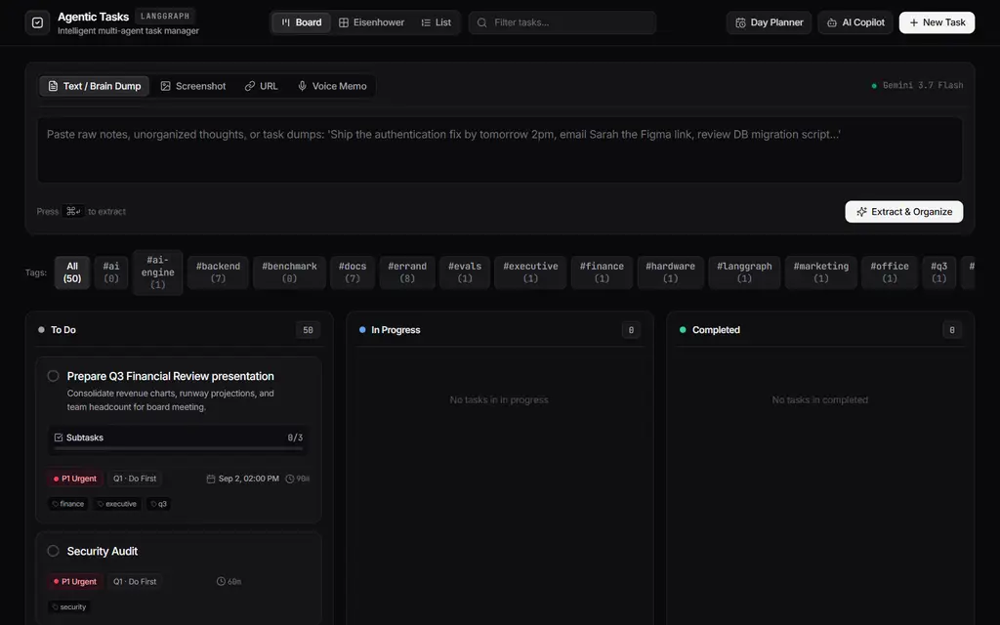

# Agentic Task Manager

> **Turn chaotic thoughts, screenshots, links, and voice notes into an organized, prioritized todo list.**  
> Built with **LangGraph**, **Google Gemini 3.7 Flash**, **FastAPI**, and **React**.

[](https://www.python.org/)
[](https://www.langchain.com/langgraph)
[](https://ai.google.dev/)
[](https://fastapi.tiangolo.com/)
[](https://react.dev/)
[](https://github.com/SriviharReddy/Agentic-Taskmanager)

---

## The Application



### Synopsis

Modern work is fragmented across communication channels and unstructured notes—from Slack threads, Jira tickets, and meeting recordings to whiteboard snapshots and raw mental brain dumps. Traditional task managers force users to manually transcribe, categorize, tag, and schedule every individual action item, creating high friction that often leads to abandoned todo lists.

**Agentic Task Manager** eliminates that manual burden. It acts as an autonomous executive assistant that accepts any input format—pasted screenshots, raw text dumps, voice memos, or web URLs—and uses a **LangGraph StateGraph** coupled with **Google Gemini 3.7 Flash** to extract structured, actionable tasks. The system resolves relative deadlines, estimates required effort, classifies items into the Eisenhower Matrix, detects duplicate tasks against your existing database, and pauses for human review when necessary before committing. With a real-time conversational AI copilot and an automated day planner, it bridges the gap between chaotic information intake and focused daily execution.

---

## Key Capabilities

### 1. Multimodal Quick Capture
Drop any text, clipboard screenshot (`Ctrl+V`), web URL, or voice recording directly into the Quick Capture bar. The agent extracts actionable items, assigns duration estimates, resolves relative dates (e.g., *"tomorrow at 2pm"* $\to$ exact timestamp), and applies categorical tags automatically.

### 2. Smart Deduplication & Human-in-the-Loop
When tasks are extracted, the ingestion graph compares them against active records in your database. If candidate tasks match existing entries or exceed batch thresholds, LangGraph triggers an `interrupt()`, surfacing a review modal where you can tweak, merge, or approve tasks before they are written to SQLite.

### 3. Eisenhower Matrix & Kanban Organization
- **Kanban Board**: Track tasks across *To Do*, *In Progress*, and *Completed*.
- **Eisenhower Matrix**: Automatically categorizes tasks into 4 quadrants (*Do First*, *Schedule*, *Delegate*, *Eliminate*) to maintain focus on high-leverage goals.
- **Filterable List**: Dense, fast table with instant search and tag filters.

### 4. Interactive AI Task Copilot
Chat with a streaming conversational assistant equipped with tools to create, update, search, prioritize, and complete tasks. The copilot drawer displays live tool execution badges with inspectable inputs and outputs.

### 5. Automated Day Planning & Timeboxing
Specify your available focus hours and preferred strategy (*Balanced, High Impact, Quick Wins, Deadline Driven*), and the agent formulates a chronological, timeboxed daily schedule with calculated buffers and clear rationale.

### 6. One-Click AI Task Breakdown
Decompose daunting tasks into 3–5 concrete checklist subtasks with a single click.

---

## Technical Documentation

For in-depth architecture diagrams, state graph breakdowns, and API specifications, see the **`docs/`** directory:

- **[System Architecture (`docs/ARCHITECTURE.md`)](docs/ARCHITECTURE.md)**  
  *End-to-end system topology, async pipeline, database schemas, and Server-Sent Events (SSE) streaming.*

- **[LangGraph Engine & StateGraphs (`docs/LANGGRAPH_ENGINE.md`)](docs/LANGGRAPH_ENGINE.md)**  
  *Detailed breakdown of the `IngestionGraph` (multimodal extraction $\to$ deduplication $\to$ `interrupt()` approval gate $\to$ commit) and `TaskCopilotGraph` (async ReAct conversational loop with tools).*

- **[API Reference (`docs/API_REFERENCE.md`)](docs/API_REFERENCE.md)**  
  *Complete REST endpoint documentation, SSE event payloads, and Pydantic request/response schemas.*

---

## Quickstart Guide

### Prerequisites
- **Python 3.11+**
- **Node.js 18+**
- **Google Gemini API Key** (from [Google AI Studio](https://aistudio.google.com/))

### 1. Clone & Configure
```bash
git clone https://github.com/SriviharReddy/Agentic-Taskmanager.git
cd Agentic-Taskmanager

# Create .env file
echo GOOGLE_API_KEY="your-gemini-api-key" > .env
```

### 2. Start Backend
```bash
pip install -r backend/requirements.txt
python -m uvicorn backend.main:app --reload --port 8000
```
*API documentation available at `http://localhost:8000/docs`.*

### 3. Start Frontend
```bash
cd frontend
npm install
npm run dev
```
*Open `http://localhost:5173` in your browser.*

---

## One-Command Docker Setup

Run the fullstack application with Docker Compose:

```bash
docker-compose up --build
```
*Access the web application at `http://localhost:8000`.*

---

## Visual Debugging with LangGraph Studio

To visually step through the state graph, inspect checkpoints, and test human-in-the-loop interrupts:

```bash
pip install -U "langgraph-cli[inmem]"
langgraph dev
```

---

## Testing & Evaluation

Run the automated test suite and evaluation benchmarks:

```bash
pytest
```
*All 9 unit tests and evaluation benchmarks validate schema correctness, fuzzy deduplication, and API lifecycle endpoints.*

---

## License

Distributed under the MIT License. See [LICENSE](LICENSE) for details.
